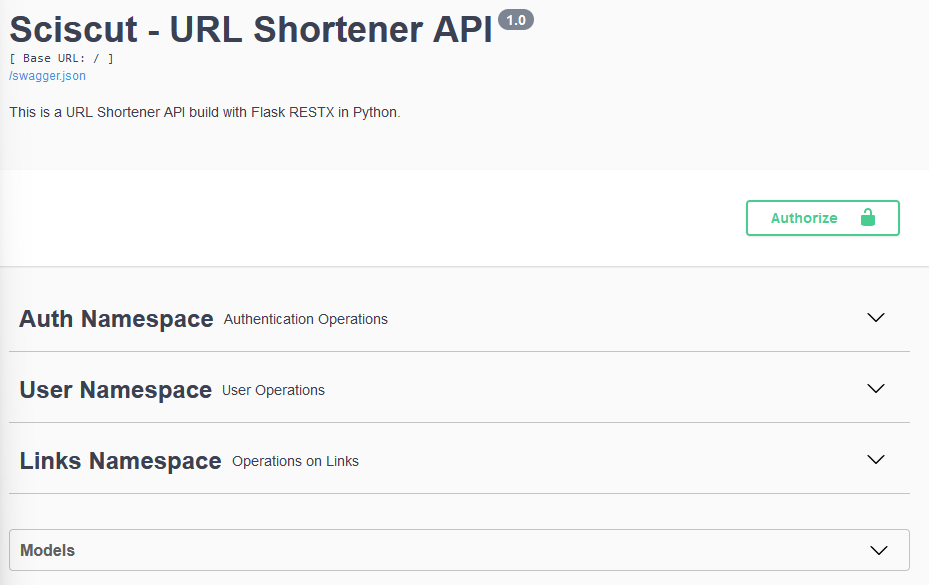
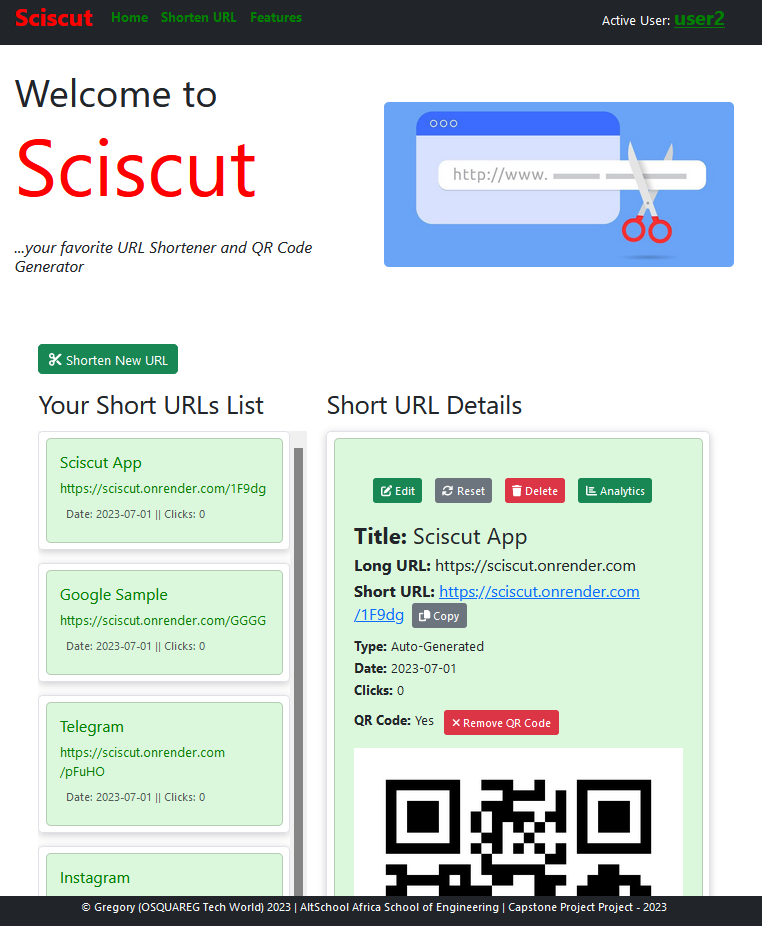
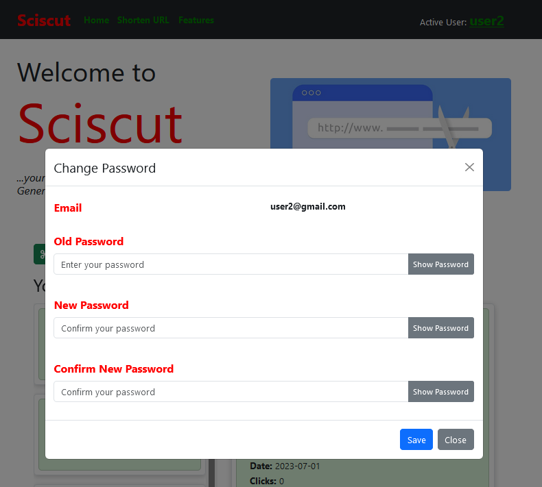
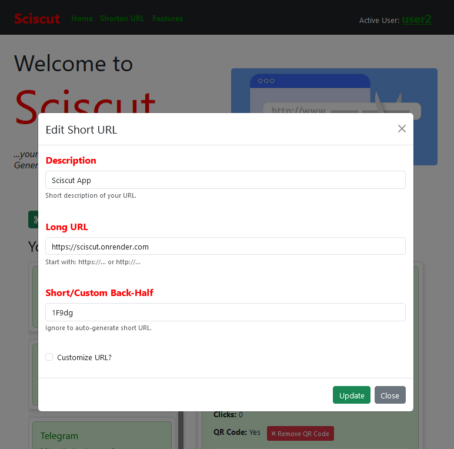
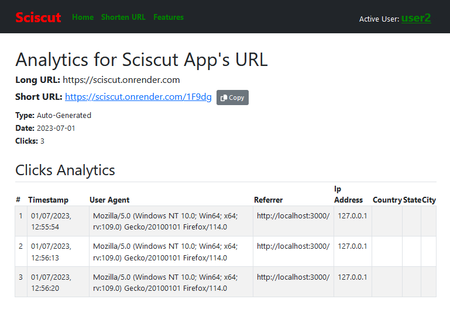

# SCISCUT - URL Shortener and QR Code Generator App

***...your favourite URL Shortener and QR Code Generator.***

## Introduction

This is a URL Shortener web app with the Backend built with **Flask RestX API** (Python Framework) and the Frontend built with **React.js** (JavaScript Framework), and deployed using render.com.

**Website:** https://sciscut.onrender.com

**API Link:** https://sciscut-api.onrender.com

## Main Functionalities

- **URL Shortener** - for shortening your long URLs into an auto-generated 5-character long URL end part.
- **URL Customizer** - for customizing your long URL making it unique for personal or corporate use.
- **QR Code Generator** - for generating QR codes for any URL, and can be downloaded for external use on social media and media posters.
- **Click Analytics** - for getting and tracking your short URL click information, such as when and where the click was performed, therefore knowing how your URL is being visited.

## Concepts Applied

##### In Backend

* Basic Python Concepts.
* Routing and Use of Namespaces
* Database Models and Relationships
* Class Inheritance and Methods
* Database Management and Migrations
* JWT Tokens for Authentications and Authorizations.
* Environment Variables
* Configuration for Development, Test and Production
* Web/Internet Security
* Debugging

##### In Frontend

* Basic Javascript Concepts.
* Create React App and Installation
* Components and Arrow Functions

## Knowledge Acquired

* Use of React JS for Frontend Design
* Use of Environment Variables for React JS
* Use of Thunder Client for testing API routes/endpoints.
* Deployment of both Web Service and Static on Render.com

## Backend API (Server-Side)



### Authentication Namespace

This namespace handles all authentications and authorizations using JWT tokens. Routes/endpoints in this namespace are:

1. **User Signup** (POST) - for creating users where are able to create their short URLs and track them as well.
2. **User Login** (POST) - this allows a signed up user to create JWT tokens that enables the user to log in to create, retrieve, update, delete, track their short URLs.
3. **Refresh Token** (POST) - for refreshing the tokens once it is expired.
4. **User Logout** (POST) - this logs out the user by blocking the JWT token.


### User Namespace

This includes all the user operations such as retrieving and updating user profile as well as password change. Routes/endpoints includes:

1. **Get Current User** (GET) - for retrieveing information about current user from the database.
2. **Update Current User** (PUT) - for updating information about the current user. ***Note: whenever an authentication data changes, the user is logged out.***
3. **Change Password** (PATCH) - for changing current password of the current user.


### Links Namespace

1. **Shorten URL** (POST) - for shortening long URL links into an auto-generated 5-character URL end part or a 20-character customized URL end part.
2. **Redirect URL** (GET /links/redirect/{short_url}) - for redirecting short URL by returning the Long URL and also records all click details for analyrics.
3. **Reset Short URL** (PATCH) - for resetting custom URLs to a short URL.
4. **Generate** **QR Code** (PATCH /links/qr_code/{link_id}) - for generating QR code for the Long URLs and saving it in the QR code folder directory.
5. **Remove QR Code** (PATCH /links/remove/qr_code/{link_id}) - for removing/deleting QR codes from the QR Code folder directory
6. **Get User Links** (GET /links/user) - for retrieving all links shortened by the current user.
7. **Get Single Link** (GET /links/{link_id}) - for retrieving a single shortened URL details from the database.
8. **Update Single Link** (UPDATE /links/{link_id}) - for updating a single shortened URL details in the database.
9. **Delete Single Link** (DELETE /links/{link_id}) - for deleting a single shortened URL details from the databse.
10. **Get Click Analytics** (GET /links/analytics/{link_id}) - for retrieving all analytic information retrieved from clicking the short URLs.


### Serializers Model


## Frontend UI (Client-Side)

### Navbar and Home Page

The Home page shows the lists of short URLs (if any) and displays any selected short URL details.

##### When Logged Out


##### When Logged In (without Short URLs List)


##### When Logged In (with Short URLs List)



### Sign up Page


### Login Page


### User Account Menu


##### View Profile


##### Update Profile


##### Change Password



### Shorten URL Page


### Edit Short URL



### Click Analytics Page (for single short URL)



## Requirements

* Install **Python 3** - for the Backend (API). Download the installation file [here](https://www.python.org/downloads/)
* Install **Node and npm** - to run the npm commands for **React.js**. Download the installation file [here](https://nodejs.org/en/download).

## How to Run the Sciscut App

### Running Deployed App/API on Your Browser

To run the deployed app, simpy visit: https://sciscut.onrender.com

To check the API endpoints documentation, go to: https://sciscut-api.onrender.com

### Running App Locally on Your Window PC

##### Run the App Backend (Server-side)

1. Clone this repository with below command: on your terminal:

   ```
   $ git clone https://github.com/OSQUAREG/Scissor-URL-Shortener-API.git
   ```
2. CD into the Scissor-URL-Shortener-API folder.

   ```
   $ cd Scissor-URL-Shortener-API
   ```
3. Create and activate your virtual environment (for Windows).

   *For Windows OS.*

   ```
   $ python -m venv venv
   $ venv/Scripts/activate
   ```

   *OR*
   *For Linux or Mac OS.*

   ```
   $ python -m venv venv
   $ venv/bin/activate
   ```
4. Install all the dependencies in the [requirements.txt](https://github.com/OSQUAREG/Scissor-URL-Shortener-API/blob/main/requirements.txt) file:

   ```
   $ pip install -r requirements.txt
   ```
5. Create the `.env` file in the project root directory. Then set the following environment variables in it:

   ```
   FLASK_APP = api/
   FLASK_DEBUG = True
   SECRET_KEY = "your-super-secret-key"
   JWT_SECRET_KEY = "your-super-secret-jwt-key"
   DEFAULT_ADMIN_PWD = "your-super-strong-admin-password"
   QR_CODE_FOLDER_PATH = "./client/public"
   ```
6. Create tables and also insert the defaults records data using the command below in the terminal:

   ```
   $ flask shell
   $ drop_create_all()
   $ exit()
   ```
7. Then run the development server with the below commands:

   ```
   $ flask run
   ```
8. Copy the server address https://localhost:5000 displayed on the terminal and paste on your browser to see all the Backend endpoints.

##### Run the App Frontend (Client-side)

1. After cloning as done in step one for the API (backend), Navigate to the client folder.

   ```
   $ cd client
   ```
2. Install dependencies, with the command:

   ```
   $ npm install
   ```
3. In case you run into issues after the `npm install` command, run below to automatically fix the issues:

   ```
   $ npm audit fix
   ```
4. Then start the development server, using below command:

   ```
   $ npm start
   ```
5. The npm start command will start the sever and automatically open the React project in your browser with the address: http://localhost:3000.


## License

Distributed under the MIT License. See [License](https://github.com/OSQUAREG/Scissor-URL-Shortener-API/blob/main/LICENSE) for more information.

## Contacts

You can contact me, Gregory Ogbemudia @OSQUAREG on:

[LinkedIn](https://www.linkedin.com/in/osquareg/) | [Twitter](https://twitter.com/OSQUAREG) | Email: [gregory.ogbemudia@gmail.com](mailto:gregory.ogbemudia@gmail.com)

## Acknowledgements

* [AltSchool Africa School of Software Engineering](https://altschoolafrica.com/schools/engineering)
* [Caleb Emelike](https://github.com/CalebEmelike)
* Other contributors and fellow students who supoorted at one point or the other.
